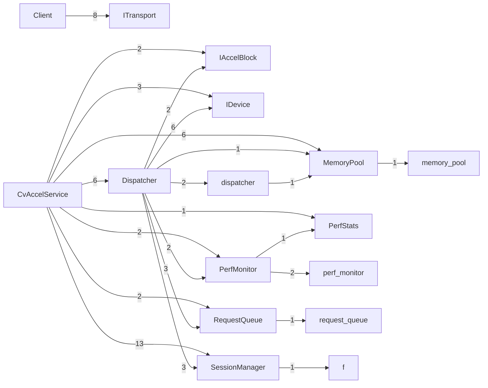

# Scenarios
Generated from the clang index (2026-09-25 09:48). One scenario per entry point (a public function no production code calls). Each file is a Mermaid sequence diagram written for reading, not rendering.

## Module overview (production calls between modules; number = call sites)

## Catalog
| Scenario (entry point) | Defined at | Participants | Messages | File |
|---|---|---|---|---|
| Client::openSession | examples/cvaccel/client/src/cvclient.cpp:33 | 2 | 1 | (not included) scenarios/Client__openSession.md |
| Client::allocMem | examples/cvaccel/client/src/cvclient.cpp:48 | 2 | 1 | (not included) scenarios/Client__allocMem.md |
| Client::freeMem | examples/cvaccel/client/src/cvclient.cpp:56 | 2 | 1 | (not included) scenarios/Client__freeMem.md |
| Client::postConfig | examples/cvaccel/client/src/cvclient.cpp:62 | 2 | 1 | (not included) scenarios/Client__postConfig.md |
| Client::submit | examples/cvaccel/client/src/cvclient.cpp:76 | 2 | 1 | (not included) scenarios/Client__submit.md |
| Client::getStats | examples/cvaccel/client/src/cvclient.cpp:100 | 2 | 1 | (not included) scenarios/Client__getStats.md |
| MemoryPool::map | examples/cvaccel/src/memory_pool.cpp:69 | 1 | 1 | (not included) scenarios/MemoryPool__map.md |
| PerfMonitor::report | examples/cvaccel/src/perf_monitor.cpp:57 | 2 | 1 | (not included) scenarios/PerfMonitor__report.md |
| CvAccelService::handle | examples/cvaccel/src/service.cpp:18 | 12 | 60 | (not included) scenarios/CvAccelService__handle.md |
| CvAccelService::clientDisconnected | examples/cvaccel/src/service.cpp:137 | 7 | 13 | (not included) scenarios/CvAccelService__clientDisconnected.md |
| CvAccelService::pump | examples/cvaccel/src/service.cpp:150 | 11 | 21 | (not included) scenarios/CvAccelService__pump.md |
| CvAccelService::queued | examples/cvaccel/src/service.cpp:155 | 2 | 1 | (not included) scenarios/CvAccelService__queued.md |
